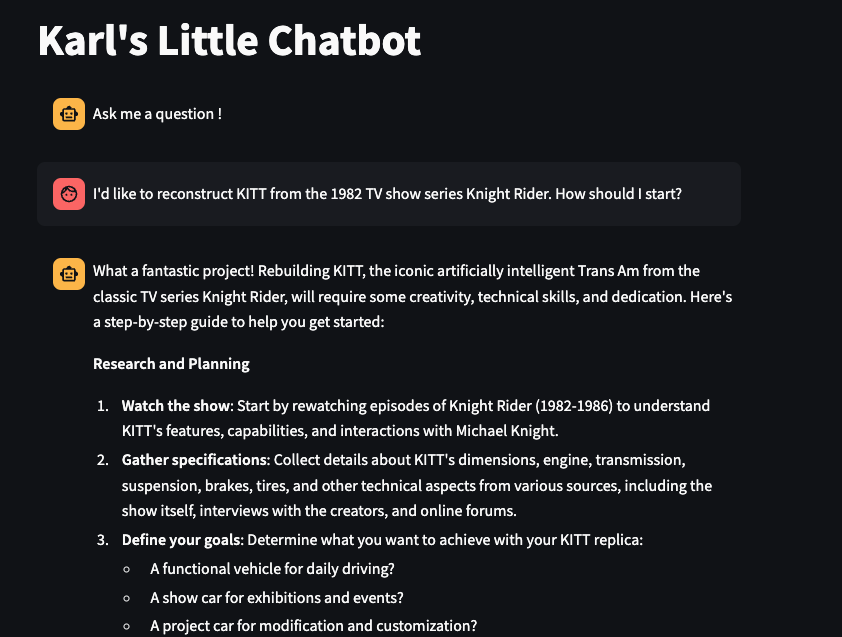
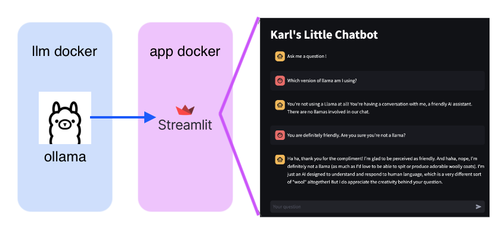

# Streamlit LLM Chatbot (Llama 3)

Using Facebook's Llama 3, this is my Streamlit app, which leverages creates two docker containers, one of which is the LLM that will run *locally* on your machine (which might be slow) and the other is the front-end application, which is served on `localhost:8501`. There are options to fine-tune Llama 3, but a more effective approach is to simply have Llama pull from a database that I create, i.e., Retrieval Augmented Generation (RAG).



In order to use this repository, you would

1. Clone it
1. Build the Docker container with `docker build -t streamlit-ollama .`
1. Run `docker-compose up`
1. Download your model
1. Go to `localhost:8501`

I've added a `.gitignore`, because you need the initial Llama 3 LLM parameters themselves, which you can pull down into a `data` folder. You'll need to do that in your docker container, where the names in the `yml` file provide the arguments to the following command that runs in your container:

```
docker exec -it streamlit-ollama ollama run llama3
```

This downloads your model into the `./data/ollama` folder, which internally maps to `/root/.ollama` in the container. (BTW, when you run the LLM, it will be served on port 11434, which the streamlit app queries.)




## Background

What are `Ollama` and `Langchain`? They're complementary tools that work together to make LLMs more accessible and useful for developers. Ollama is a Python library that runs open-source LLMs (or calls paid ones with a key). It provides a simple interface for interacting with the models, enabling us to send text prompts and receive responses (via json). The most efficient ones that I've used are from [Facebook](https://llama.meta.com/), although they're slow.

Ollama:

Gemini actually provides a pretty good analogy: imagine your app as a race car. Ollama is the powerful car engine under the hood. Langchain is the cockpit / controls of that car (e.g., steering wheels, pedals, etc.)

## Embeddings

Ollama also has built in functions to obtain embeddings. After you've built your container (though alternatively, you can create a new Docker image), you can go into the container and set up Python3.

```
    1  ls
    2  cd /root
    3  apt update
    4  apt-get install python3
    5  apt install python3-pip
    6  pip install ollama
    7  pip install ipython
```

Inside the Python shell, you can then do something like this:

```
import ollama
response = ollama.chat(model='llama3', messages = [ { 'role': 'user', 'content': "I'm testing the interface with Python. Hello?"},])
print(response['message']['content'])

embedding = ollama.embeddings(model= 'llama3', prompt= 'Can I get an embedding')
print(embedding['embedding'])
```


## References

Here are some useful blogs that I reviewed. 

* [A B Vijay Kumar](https://abvijaykumar.medium.com/ollama-build-a-chatbot-with-langchain-ollama-deploy-on-docker-5dfcfd140363) - Effectively what I've done here.
* [Ollama's Python RAG Code](https://github.com/ollama/ollama/blob/main/examples/langchain-python-rag-document/main.py) - From Ollama's site


